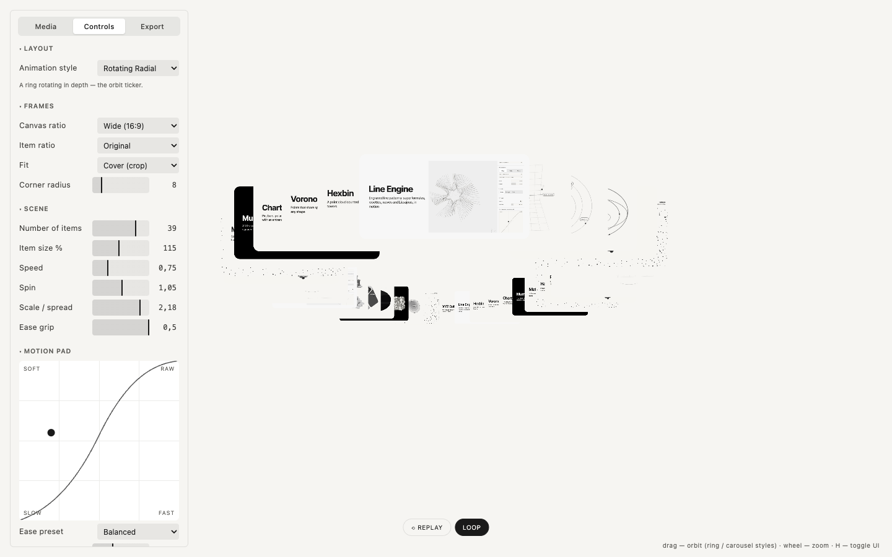

  

<h1 align="center">Image Shuffler</h1>

  Your screens flying in 3D, ready to record as a video 
  one HTML file · runs in the browser · no install · free and open source

  <a href="https://robvagin.github.io/image-shuffler/"><b>Open Image Shuffler</b></a> ·
  <a href="#run-it">Run it</a> ·
  <a href="#more-tools">More tools</a>

---

Drop in screenshots of your work and they fly: a ring, a carousel, a path through space. Pick a frame size for any feed and record it.

## What it does

- **Your images:** drop them in, or start from demo tiles
- **Layouts:** ring, carousel and paths along axes, with depth and a free camera
- **Frames for any feed:** 16:9, 1:1, 4:5, 9:16, cover or contain
- **Motion pad** for the character of the flight
- **Export:** record a video, a PNG frame and a JSON project

## Run it

Open [robvagin.github.io/image-shuffler](https://robvagin.github.io/image-shuffler/), or download `index.html` and open it from your disk. It is the whole tool: no build step, no dependencies, no network. Press **H** to hide the panel.

## Made by a designer

I'm a designer. I build small tools like this for my own work, with AI agents: I make the decisions, Claude Code writes the code. The panels follow one grammar across the whole set.

Take it if you want it.

## More tools

- [Particle Dance](https://github.com/robvagin/particle-dance) · particles that dance along patterns and 3D forms
- [Murmur](https://github.com/robvagin/murmur-vj) · a VJ visualizer: circles, triangles and squares that move to your music
- [Orbital](https://github.com/robvagin/orbital) · data as orbits, axes or a bending mesh
- [Metaballs](https://github.com/robvagin/metaballs) · soft masses that merge, split and leave holes
- [Halftone Cloud](https://github.com/robvagin/halftone-cloud) · images rebuilt as a halftone of flying shapes
- [Logomachine](https://github.com/robvagin/logomachine) · seeded generative marks: one seed, one pattern, always
- [Motion Primer](https://github.com/robvagin/motion-primer) · bodies with behaviors: swarm, pack, magnet, orbit, fall, scatter
- [Particles 3D](https://github.com/robvagin/particles-3d) · a WebGL2 cloud of up to 300,000 particles
- [Guilloche](https://github.com/robvagin/guilloche) · guilloche line work: rosettes, weaves, tori and Chladni figures
- [Unison](https://github.com/robvagin/unison) · metronomes on one board falling into unison
- [Line Engine](https://github.com/robvagin/line-engine) · engraved line patterns: superformulas, rosettes, waves and Lissajous, in motion
- [XYZ Cube](https://github.com/robvagin/xyz-cube) · your data as points in a 3D cube on axes you name
- [Hexbin](https://github.com/robvagin/hexbin) · a point cloud counted into 3D hexagon towers
- [Chart 3D](https://github.com/robvagin/chart-3d) · pie, bars, polar and area charts in 3D, with an entrance
- [Sunburst](https://github.com/robvagin/sunburst) · a hierarchy as a 3D sunburst with height
- [Voronoi](https://github.com/robvagin/voronoi) · points that share space as cells, inside any shape
- [Pixel Ring](https://github.com/robvagin/pixel-ring) · rings drawn in pixels
- [Motion Pad](https://github.com/robvagin/motion-pad) · one pad for the character of motion

## License

[MIT](LICENSE) © 2026 Robert Vagin
